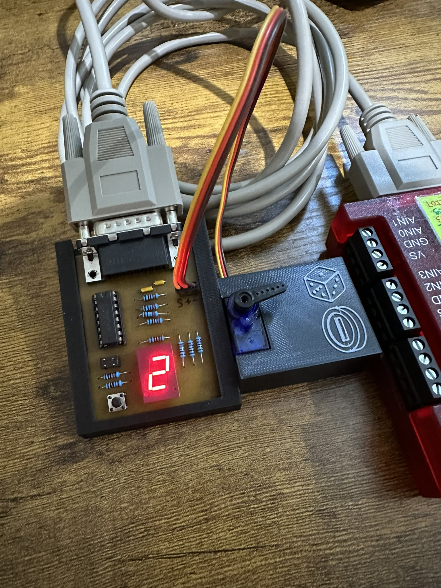

# HSI266 Project
This is my project for the HSI266 course. It's a random number generator! When shaken/tilted, it'll roll a d6 or flip a coin. It'll also periodically upload the data to the Seneca Matrix server to view on a web page.

Device                                           | In use
:-----------------------------------------------:|:-----------------------------------------------:
 | 
